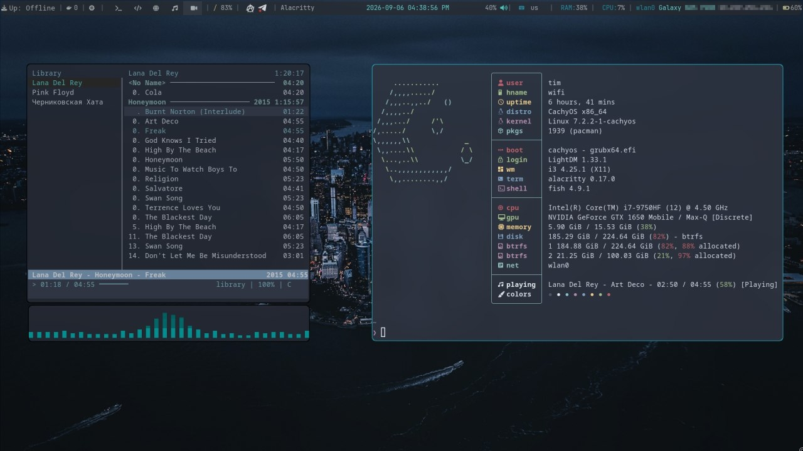
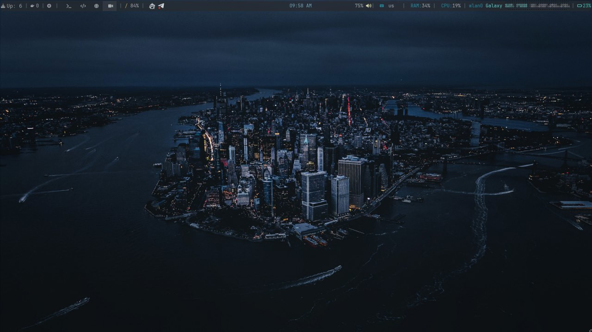
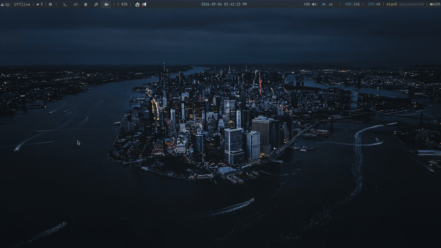

# i3 Desktop Configuration

This repository contains configuration files for an **i3** desktop environment on **CachyOS**, themed around a single cyan-on-charcoal palette applied from the bootloader through to the terminal.

---

---

## Stack

| Component | Program |
| --------- | ------- |
| Window manager | `i3` |
| Status bar | `polybar` |
| Compositor | `picom` (ibhagwan fork, `dual_kawase` blur) |
| Launcher | `rofi` |
| Notification daemon | `dunst` |
| Terminal | `alacritty` |
| Shell | `fish` + Pure prompt |
| Editor | `neovim` (LazyVim) |
| Display manager | `lightdm` + `lightdm-mini-greeter` |
| Bootloader theme | GRUB + Space Isolation |
| Music player | `cmus` |
| File manager | `yazi` |
| System monitor | `btop` |

Fonts: **JetBrains Mono**, **FiraCode Nerd Font**, **Symbols Nerd Font**.

## Host-Specific Values

The following require adjustment before use on another machine:

| Location | Value |
| -------- | ----- |
| `polybar/config` | `monitor` output name |
| `polybar/config` | `battery` / `adapter` identifiers |
| `i3/config` | `xrandr` output configuration |
| `i3/config` | Lenovo `conservation_mode` sysfs path |
| Greeter config | `user` |

Several scripts reference absolute paths under the author's home directory.

System-level configuration outside `~/.config` (`/etc/lightdm/`, `/etc/default/grub`) is not managed here.

## Credits

| Project | Use |
| ------- | --- |
| [Nord](https://www.nordtheme.com/) | Base palette |
| [Space Isolation](https://github.com/callmenoodles/space-isolation) | GRUB theme |
| [Pure](https://github.com/pure-fish/pure) | Fish prompt |
| [LazyVim](https://lazyvim.github.io/) | Neovim configuration base |

Thx dharmx for superb [nord wallpaper archive](https://github.com/dharmx/walls/tree/main/nord) <3
